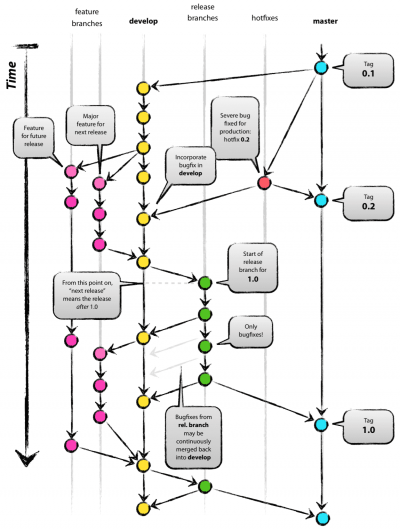
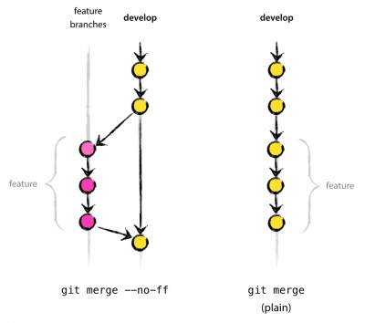
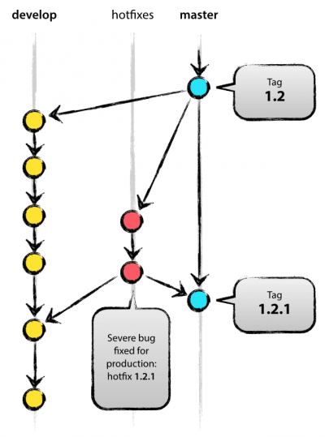

# QualiteLogicielle



## Branches principales

Origin détient deux branches principales _infinies dans le temps_:

* master
* develop

**origin/master** est la branche principale où le code source est prêt à être mis en production.

**origin/develop** est la branche principale où le code représente les derniers changements délivrés pour la prochaine _release_. On l'appelle aussi la branche d'intégration, c'est la source des _nightly builds_.

Quand le code de **develop** est stable et est prêt à être _release_, tous les changements sont _mergés_ dans **master** et _taggés_ avec un _numéro de release_.

Par définition, à chaque _merge_ dans **master**, c'est une nouvelle _release_. On peut ainsi automatiser les _builds_ et la mise en prod à chaque commit sur **master**.

## Branches secondaires

Le modèle **GitFLow** intègre des branches secondaires afin d'aider le développement en parallèle entre les différents membre de l'équipe, facilement suivre les _features_, préparer la mise en prod et assister la réparation des problèmes en prod. Contrairement aux branches principales, ces branches secondaires sont _limitées dans le temps_. Enfin, elles suivent toutes un but précis et respectent des règles strictes comme, la convention de nommage, la branche dont elles sont issues et la branche dans laquelle elles seront _mergées_.

* Feature
* Release
* Hotfix

## Feature
  
* Branche source: **develop**
* Branche cible: **develop**
* Nom: tout sauf **master**, **develop**, **release-***, **hotfix-***

La branche **feature** est utilisée pour développer des nouvelles fonctionnalités destinées à une future _release_. La branche **feature** existe  aussi longtemps que que la fonctionnalité est en développement, mais finira par être _mergée_ dans **develop**.

### Créer une branche feature

```bash
git checkout -b myfeature develop
# Switched to a new branch "myfeature"
```

### Incorporer une branche feature dans develop

```bash
git checkout develop
# Switched to branch 'develop'

git merge --no-ff myfeature
# Updating ea1b82a..05e9557 (Summary of changes)

git branch -d myfeature
# Deleted branch myfeature (was 05e9557).

git push origin develop
```

L'option _--no-ff_ permet de toujours créer un _merge-commit_, même si la branche peut-être _merge_ en _fast-forward_. Cela permet d'éviter de perdre des informations sur l'historique de la branche _feature_ et regroupe tous les commits qui ont créés cette fonctionnalité.



## Release

* Branche source: **develop**
* Branche cible: **develop** et **master**
* Nom: _release-*_

Les branches **release** aident la mise en production. Elles autorisent la réparation de bug mineurs, prépare les metadonnées pour la _release_ (numéro de version, date de build...). Cela permet de libérer la branche **develop** pour recevoir les fonctionnalités de la prochaine grosse _release_.

La branche **release** est créer au moment où **develop** contient toutes les fonctionnalitées de la _release_ en cours. En revanche toutes les fonctionnalités de la prochaine _release_ ne doivent pas être _mergées_ dans **develop**.

C'est au moment de la création de la branche **release** que la _release_ en cours se voit assignée un numéro de version.

### Créer une branche release

```bash
git checkout -b release-1.2 develop
# Switched to a new branch "release-1.2"

./bump-version.sh 1.2
# Files modified successfully, version bumped to 1.2.

git commit -a -m "Bumped version number to 1.2"
# [release-1.2 74d9424] Bumped version number to 1.2
# 1 files changed, 1 insertions(+), 1 deletions(-)
```

bump_version.sh est un script fictionnel qui change certains fichiers dans le _working-tree_ en fonction du numéro de version attribué.

La branche **release** peut exister un moment jusqu'à ce qu'elle soit _mergée_ et supprimée. Durant cette période des corrections peuvent être appliquées.

### Incorporer une branche release

La branche est _merge_ dans **master** ensuite ce dernier _commit_ sur **master** est _taggé_. Enfin les changements faits sur la **release** (corrections de bugs) doivent être _merge_ sur **develop**.

```bash
git checkout master
# Switched to branch 'master'

git merge --no-ff release-1.2
# Merge made by recursive.
# (Summary of changes)

git tag -a 1.2

git checkout develop
# Switched to branch 'develop'

git merge --no-ff release-1.2
# Merge made by recursive.
# (Summary of changes)

git branch -d release-1.2
# Deleted branch release-1.2 (was ff452fe).
```

## Hotfix

* Branche source: **master**
* Branche cible: **develop** et **master**
* Nom: **hotfix-***



Les branches **hotfix** aident à la préparation pour la mise en prod. Ellles découlent de la nécessité d’agir immédiatement sur un état non souhaité d’une version en production. Ansi, le développement peut continuer pendant qu'une autre personne peut préparer une correction rapide de la prod.

### Créer une branche hotfix

Créer à partir de la branche **master**, afin de corriger un bug sur la prod mais les changements sur **develop** sont instables.

```bash
git checkout -b hotfix-1.2.1 master
# Switched to a new branch "hotfix-1.2.1"
./bump-version.sh 1.2.1
# Files modified successfully, version bumped to 1.2.1.

git commit -a -m "Bumped version number to 1.2.1"
# [hotfix-1.2.1 41e61bb] Bumped version number to 1.2.1
# 1 files changed, 1 insertions(+), 1 deletions(-)

git commit -m "Fixed severe production problem"
# [hotfix-1.2.1 abbe5d6] Fixed severe production problem
# 5 files changed, 32 insertions(+), 17 deletions(-)
```

#### Incorporer une branche hotfix

Quand elle est finit la branche **hotfix** doit être _merge_ dans **master** mais aussi dans **develop**. On s'assure ainsi que le prochaine _release_ contient la correction.

```bash
git checkout master
# Switched to branch 'master'

git merge --no-ff hotfix-1.2.1
# Merge made by recursive.
# (Summary of changes)

git tag -a 1.2.1

$ git checkout develop
# Switched to branch 'develop'

git merge --no-ff hotfix-1.2.1
# Merge made by recursive.
# (Summary of changes)

git branch -d hotfix-1.2.1
# Deleted branch hotfix-1.2.1 (was abbe5d6).
```

Une seule exception peut être faite. Si une _release_ est en cours, soit une branche **release** encore ouverte. Les changements de **hotfix** doivent être _merge_ dans **release** au lieu de **develop**. Les changements seront _mergés_ dans **develop** au moment de l'incorporation de la branche **release**.

## Commit message

[Source](https://chris.beams.io/posts/git-commit/)

* Séparer le sujet du corps par une ligne
* Limiter le sujet à 50 caractères
* Capitaliser le sujet
* Ne pas finir le sujet avec un point
* Ecrire à l'impératif
* Limiter la largeur du corps à 72 caractères
* Utiliser le corps pour expliquer pourquoi au lieu de comment

Exemple:

``` bash
Summarize changes in around 50 characters or less

More detailed explanatory text, if necessary. Wrap it to about 72
characters or so. In some contexts, the first line is treated as the
subject of the commit and the rest of the text as the body. The
blank line separating the summary from the body is critical (unless
you omit the body entirely); various tools like `log`, `shortlog`
and `rebase` can get confused if you run the two together.

Explain the problem that this commit is solving. Focus on why you
are making this change as opposed to how (the code explains that).
Are there side effects or other unintuitive consequences of this
change? Here\'s the place to explain them.

Further paragraphs come after blank lines.

 - Bullet points are okay, too

 - Typically a hyphen or asterisk is used for the bullet, preceded
   by a single space, with blank lines in between, but conventions
   vary here

If you use an issue tracker, put references to them at the bottom,
like this:

Resolves: #123
See also: #456, #789
```

### Séparer le sujet du corps par une ligne

Tous les commits ne nécessitent pas un sujet et un corps. Dans le cas contraire, résumer le changement effectué en moins de 50 caractères, suivis par une ligne vide, puis une description plus complète. Le texte au dessus de la ligne blanche est traité comme le titre du message et est utilisé partout dans git. Le corps lui n'est affiché que lorsque l'on consulte le détail du commit.
Il est compliqué d'éditer un message complet en ligne de commande [Commit template](https://git-scm.com/book/en/v2/Customizing-Git-Git-Configuration).

### Limiter le sujet à 50 caractères

Si résumer ce que l'on vient de réaliser en 50 caractères est compliqué, c'est peut-être que l'on commit trop de changements en un. [Atomic commit](https://www.freshconsulting.com/atomic-commits/)

### Capitaliser le sujet

Commencer tous les sujets par une majuscule

```bash
Accelerate to 88 miles per hour
  vs.
accelerate to 88 miles per hour
```

### Ne pas finir le sujet avec un point

La ponctuation n'est pas nécessaire dans le sujet, de plus l'espace est précieux.

```bash
Open the pod bay doors
  vs.
Open the pod bay doors.
```

### Ecrire à l'impératif

Git lui même utilise l'impératif lorsqu'il crée un commit en votre nom. De plus l'espace est précieux.

```bash
Refactor subsystem X for readability
Update getting started documentation
Remove deprecated methods
Release version 1.0.0
  vs.
Fixed bug with Y
Changing behavior of X
```

Un sujet de commit bien formaté doit être en mesure de compléter la phrase: if applied, this commit will.

```bash
If applied, this commit will refactor subsystem X for readability
  vs
If applied, this commit will fixed bug with Y
```

### Limiter la largeur du corps à 72 caractères

Git ne limite par la largeur du corps et rend le commit difficilement lisible lors de la visualisation de log en ligne de commande. Il est conseillé de passer à la ligne au bout de 72 caractères. Aujourd'hui, ceci est géré dans la plupart des outils complémentaires de versionning.

### Utiliser le corps pour expliquer pourquoi au lieu de comment

Bon exemple de _Bitcoin Core_

```bash
commit eb0b56b19017ab5c16c745e6da39c53126924ed6
Author: Pieter Wuille <pieter.wuille@gmail.com>
Date:   Fri Aug 1 22:57:55 2014 +0200

   Simplify serialize.h's exception handling

   Remove the 'state' and 'exceptmask' from serialize.h's stream
   implementations, as well as related methods.

   As exceptmask always included 'failbit', and setstate was always
   called with bits = failbit, all it did was immediately raise an
   exception. Get rid of those variables, and replace the setstate
   with direct exception throwing (which also removes some dead
   code).

   As a result, good() is never reached after a failure (there are
   only 2 calls, one of which is in tests), and can just be replaced
   by !eof().

   fail(), clear(n) and exceptions() are just never called. Delete
   them.
```

En regardant tous les changements fait dans le [Code](https:github.com/bitcoin/bitcoin/commit/eb0b56b19017ab5c16c745e6da39c53126924ed6) il est impossible de facilement comprendre le contexte. L'auteur a donc pris le temps d'expliquer concrètement ce qu'il a supprimé et modifié, pourquoi ces changements ont été réalisé et enfin le résultat de cette modification, le comportement du programme une fois les changements appliqués.